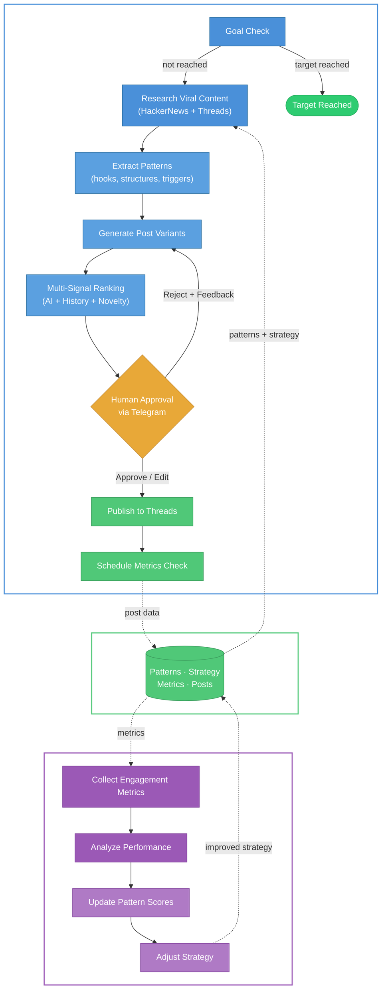
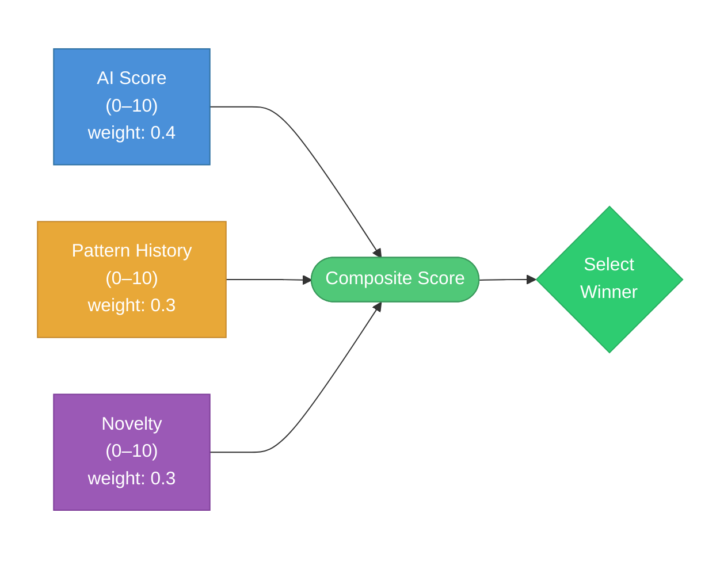
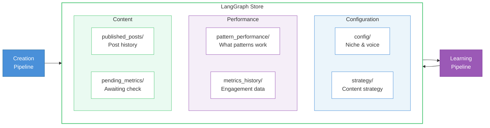

```mermaid
graph LR
    R["Research<br/>What's viral?"] --> E["Extract<br/>Why it works"]
    E --> G["Generate<br/>Using patterns"]
    G --> K["Rank<br/>AI + History + Novelty"]
    K --> P["Publish<br/>Post the winner"]
    P --> M["Measure<br/>Wait 24h, collect data"]
    M --> L["Learn<br/>What worked & why"]
    L --> A["Adapt<br/>Update strategy"]
    A -->|"feed back"| R

    style R fill:#4A90D9,stroke:#2C6FA0,color:#fff
    style E fill:#5BA0E0,stroke:#2C6FA0,color:#fff
    style G fill:#5BA0E0,stroke:#2C6FA0,color:#fff
    style K fill:#E8A838,stroke:#C4872A,color:#fff
    style P fill:#50C878,stroke:#3A9A5C,color:#fff
    style M fill:#9B59B6,stroke:#7D3C98,color:#fff
    style L fill:#AF7AC5,stroke:#7D3C98,color:#fff
    style A fill:#AF7AC5,stroke:#7D3C98,color:#fff
```

<div align="center">

# AutoViralAI

### Your social media grows while you sleep.

<p>
An autonomous AI agent that researches what's going viral, generates content,<br/>
publishes it, measures engagement — and <strong>rewrites its own strategy based on what actually worked</strong>.
</p>

<br/>

[](https://github.com/kgarbacinski/AutoViralAI/actions/workflows/ci.yml)
[](https://www.python.org/downloads/)
[](LICENSE)
[](https://github.com/langchain-ai/langgraph)

[Quick Start](#-quick-start) · [How It Works](#-how-it-works) · [Configuration](#-configuring-your-niche) · [Contributing](CONTRIBUTING.md)

</div>

---

**The problem:** You know you should be posting consistently. You know what kind of content performs. But researching trends, writing posts, tracking what works, adjusting strategy — it's a full-time job.

**The solution:** AutoViralAI does the entire loop autonomously. It doesn't just post — it *learns*. Every day it gets a little better at understanding what your audience actually engages with.

```
Day 1:   "Here's a generic coding tip"            → 12 likes
Day 7:   "Hot take: most devs don't need Docker"   → 340 likes
Day 14:  Agent learned contrarian hooks work 3x     → adapts strategy automatically
Day 30:  Posts consistently hit 500+ engagement     → you didn't write a single one
```

## Why AutoViralAI?

Most "AI social media tools" are glorified schedulers with a GPT wrapper. They generate generic content, blast it out, and call it a day.

**AutoViralAI is fundamentally different:**

| Traditional tools | AutoViralAI |
|---|---|
| Generate content from a static prompt | Research what's *actually* going viral right now, extract the patterns, and generate content using those patterns |
| Same strategy forever | Strategy evolves daily based on real engagement data |
| Post and forget | Measure results after 24h, learn what worked and why, feed it back |
| AI picks the post | Multi-signal ranking: AI score + historical pattern performance + novelty scoring |
| Fully automated (risky) | Human-in-the-loop: you approve every post via Telegram before it goes live |

## Key Features

**Self-Learning Loop** — The agent doesn't just execute. It observes, measures, and adapts. Pattern that got 3x engagement? It'll use it more. Strategy that flopped? Automatically deprioritized.

**Multi-Signal Ranking** — Posts aren't ranked on "AI vibes." Each variant scores on 3 independent signals: AI-evaluated viral potential, historical pattern performance, and novelty (so it doesn't repeat itself).

**Human-in-the-Loop** — Nothing gets published without your approval. The agent sends you the top-ranked post via Telegram. You approve, edit, or reject. Built on LangGraph's `interrupt()` — survives server restarts.

**Niche-Aware** — Define your voice, audience, content pillars, and topics to avoid in a single YAML file. The agent stays on-brand in every cycle.

**Research-Driven** — Before generating anything, the agent scrapes Reddit, Threads, and HackerNews to understand what's trending *right now* in your niche. No hallucinated trends.

**Production-Ready** — PostgreSQL persistence, Docker deployment, CI/CD via GitHub Actions, Telegram webhooks, APScheduler for cron-like execution. Not a toy — this runs 24/7.

## Quick Start

### Prerequisites

- Python 3.13+
- [uv](https://docs.astral.sh/uv/) (recommended) or pip
- An [Anthropic API key](https://console.anthropic.com/)

### Setup

```bash
git clone https://github.com/kgarbacinski/AutoViralAI.git
cd AutoViralAI
uv sync
cp .env.example .env
# Edit .env → set ANTHROPIC_API_KEY (minimum required)
```

### Run Your First Cycle

```bash
# Interactive mode — you approve/reject posts in the terminal
uv run python scripts/manual_run.py

# Auto-approve mode (for testing the full pipeline)
uv run python scripts/manual_run.py --auto-approve

# Run the learning pipeline
uv run python scripts/manual_run.py --pipeline learning
```

The first run uses **mock APIs** — no social media account needed. You'll see the full pipeline execute with realistic simulated data.

## How It Works

The system runs **two independent pipelines** that share a knowledge base:



**Why two pipelines?** Posts need 24-48 hours to accumulate meaningful engagement data. The creation pipeline runs multiple times per day, while the learning pipeline runs once daily on yesterday's data — then feeds the improved strategy back into creation.

### The Self-Learning Loop



### Multi-Signal Ranking

Each variant gets a **composite score** from three independent signals:



| Signal | What it measures | How |
|--------|-----------------|-----|
| **AI Score** (0-10) | Viral potential: hook strength, emotional trigger, shareability | Claude evaluates each variant |
| **Pattern History** (0-10) | How well this pattern performed in the past | Cumulative engagement data from knowledge base |
| **Novelty** (0-10) | How different this is from recent posts | Cosine distance of embeddings vs last 20 posts |

New patterns get a **5.0 exploration bonus** — the system balances exploitation (use what works) with exploration (try new things).

### Human-in-the-Loop

The agent never posts without your approval. Before the approval message, you get a **full pipeline report** showing what each agent did — research results, extracted patterns, generated variants, and ranking breakdown. Then:

```
┌──────────────────────────────────────────┐
│  Telegram Bot                            │
│                                          │
│  New Post for Approval (Cycle #7)        │
│  Followers: 43                           │
│  ─────────────────────────────           │
│  Hot take: 90% of "clean code"           │
│  advice makes your code slower.          │
│  ─────────────────────────────           │
│  Score: 7.8/10 (+1.2 vs avg 6.6)        │
│  Pattern: contrarian_hot_take — 4.2% ER  │
│  Best publish time: 08:00, 12:30         │
│                                          │
│  Recent posts:                           │
│   1. 3.50% ER | 42L 5R | "Most devs..." │
│   2. 2.10% ER | 28L 3R | "Docker is..." │
│                                          │
│  [Approve]  [Reject]                     │
│  [Edit]     [Publish Later]              │
│  [Use Alt 1]  [Use Alt 2]               │
└──────────────────────────────────────────┘
```

Built on LangGraph's `interrupt()` — the graph pauses, saves state, and resumes when you respond. Survives server restarts.

## Configuring Your Niche

Edit `config/account_niche.yaml` to define your identity:

```yaml
niche: "tech"
sub_niche: "programming & startups"

voice:
  tone: "conversational, insightful, slightly provocative"
  persona: "experienced developer who shares hard-won lessons"
  style_notes:
    - "Use short, punchy sentences"
    - "Lead with a controversial or surprising take"
    - "End with a question or call-to-action"

content_pillars:
  - name: "hot_takes"
    description: "Contrarian opinions on tech trends"
    weight: 0.30
  - name: "practical_tips"
    description: "Actionable coding tips and tool recommendations"
    weight: 0.25
  # ... add your own pillars

avoid_topics:
  - "political opinions unrelated to tech"
  - "cryptocurrency shilling"
```

The agent uses this config in every generation cycle to stay on-brand and on-topic.

## Architecture

```
AutoViralAI/
├── config/
│   ├── account_niche.yaml       # Your niche, voice, audience, content pillars
│   └── settings.py              # Environment config (pydantic-settings)
│
├── src/
│   ├── models/                  # Pydantic models + TypedDict states
│   ├── graphs/                  # LangGraph pipeline definitions
│   │   ├── creation_pipeline.py # Research → generate → approve → publish
│   │   └── learning_pipeline.py # Metrics → analyze → learn → adapt
│   ├── nodes/                   # Individual pipeline steps (12 nodes)
│   ├── tools/                   # External service wrappers (mock-first)
│   ├── prompts/                 # All LLM prompt templates
│   ├── store/                   # Knowledge base (LangGraph Store)
│   ├── orchestrator.py          # APScheduler (cron-like scheduling)
│   └── persistence.py           # Checkpointer + Store factory
│
├── bot/                         # Telegram bot (approval, commands, config)
├── api/                         # FastAPI server
├── scripts/                     # Manual run, init, health check
└── tests/                       # pytest suite
```

## Knowledge Base

Both pipelines share a persistent knowledge base via [LangGraph Store](https://langchain-ai.github.io/langgraph/concepts/persistence/#store):



Dev: `InMemoryStore` · Prod: `AsyncPostgresStore` with embedding support.

## Tech Stack

| Component | Technology | Purpose |
|-----------|-----------|---------|
| Agent Framework | [LangGraph](https://github.com/langchain-ai/langgraph) 0.3+ | Two-graph architecture with shared state |
| LLM | Claude Sonnet 4 via [langchain-anthropic](https://github.com/langchain-ai/langchain) | Pattern extraction, generation, ranking, analysis |
| State Persistence | LangGraph Checkpointer | Survives interrupts, restarts, crashes |
| Knowledge Base | LangGraph Store | Cross-pipeline memory with namespaces |
| Human-in-the-Loop | LangGraph `interrupt()` + [python-telegram-bot](https://github.com/python-telegram-bot/python-telegram-bot) | Pause graph, notify via Telegram, resume on response |
| Research | [PRAW](https://praw.readthedocs.io/) + [Apify](https://apify.com/) | Reddit + Threads viral content discovery |
| Novelty Scoring | Cosine similarity on embeddings | Prevent repetitive content |
| Scheduling | [APScheduler](https://apscheduler.readthedocs.io/) | Creation 3x/day, learning 1x/day |
| API | [FastAPI](https://fastapi.tiangolo.com/) | Webhook receiver + status endpoints |
| Database | PostgreSQL (prod) / In-memory (dev) | Checkpoints, store, metrics |
| Validation | [Pydantic](https://docs.pydantic.dev/) v2 | Structured LLM output + data models |

## Tests

```bash
# Run all tests
uv run pytest

# With coverage
uv run pytest --cov=src --cov=bot --cov=api --cov-report=term-missing

# Lint
uv run ruff check .
```

## Production Deployment

Push to `main` → GitHub Actions runs lint, test, and deploys automatically via SSH + Docker.

```bash
# Local development with Docker
docker compose up -d
```

## Roadmap

- [x] Two-graph architecture (creation + learning)
- [x] Mock-first development (works without API keys except Anthropic)
- [x] Multi-signal ranking (AI + history + novelty)
- [x] Human-in-the-loop via `interrupt()`
- [x] Configurable niche/voice/audience
- [x] CI/CD: GitHub Actions → auto-deploy on push to main
- [x] Telegram bot approval flow (end-to-end)
- [x] Pipeline transparency — full AI agent report (research, patterns, generation, ranking)
- [x] Enriched approval messages — metrics benchmark, pattern rationale, optimal publish time
- [x] Reject with feedback — reason buttons feed back into the learning loop
- [x] Publish later — schedule approved posts for optimal times
- [x] Bot commands — `/metrics`, `/history`, `/schedule`, `/force`, `/learn`, `/research`, `/pause`, `/resume`
- [x] Remote config via Telegram — `/config` to change tone, language, hashtags, posting schedule
- [x] Live `/status` — running/paused state, cycles, pending approvals, next run
- [x] Standalone `/research` — see what virals the agent finds without running the full pipeline
- [x] Real Threads API integration
- [ ] LangSmith observability dashboard
- [ ] A/B testing (publish two variants, compare)
- [ ] Multi-platform support (X, Bluesky, LinkedIn)
- [ ] Web dashboard for strategy visualization
- [ ] Configurable LLM provider (OpenAI, Ollama)
- [ ] Plugin system for research sources

## Contributing

Contributions are welcome! Please read the [Contributing Guide](CONTRIBUTING.md) for details on the development workflow, code style, and how to submit pull requests.

Some good first issues:

- Add more content pattern templates
- Implement real Reddit research with better filtering
- Add retry logic with exponential backoff for API calls
- Build a web dashboard showing learning progress
- Add support for image/carousel posts
- Add support for new platforms (X, LinkedIn, Bluesky)

## License

[MIT](LICENSE)
